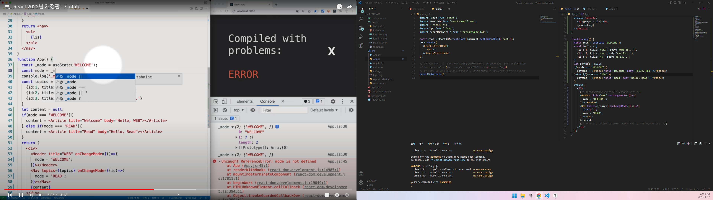
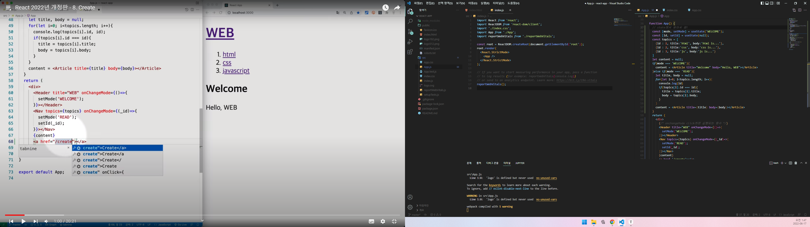

# React 공부

### index.js => 입구

### 사용자 정의태그 만들기

사용자 정의 태그 만들때 반드시 처음에 대문자!

### PROPS

### onChangMode(onclick)

: click하면 실행되는 함수 정의

event.target=> 여기까지는 event를 유발하는 tag

event.target.id=> event를 유발하는 tag의 id

### State

0은 값을 저장

1번은 상태를 변경할때 쓰는것

const a = b.a

const {a} = b;

### CREATE

