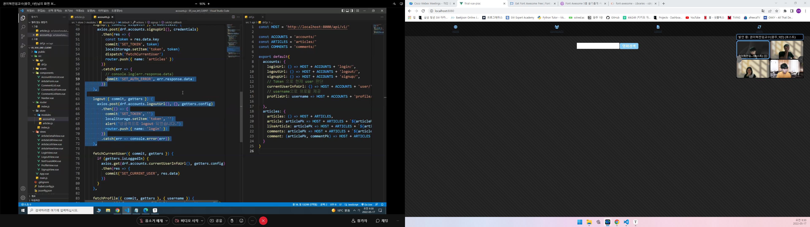

Serializer => 이렇게 구성해서 보내줘.(JSON 표현의 영역)

장고에서 user_id 받고 다시 장고서버에 id로 name찾을려고 다시 요청보낸다.

## Serializer 복습

```python
@api_view(['GET'])
def actor_list(request):
    actors = get_list_or_404(Actor)
   	serializer = ActorSerializer(actors, many=True)
    return Response(serializer.data)


```

Authentication = 권한

authorization = 인증

Token Based

- Basic Token
- JWT

 pip install django==3.2.12 djangorestframework django-extensions

https://image.tmdb.org/t/p/w500/AdyJH8kDm8xT8IKTlgpEC15ny4u.jpg

NowPlaying , Search, popular, recommendation(날씨, 카테고리)


ReviewSerializer - title, movie_title, created_at, updated_at, content, comments


ReviewListSerializer - movie_title, title, review.rank,user_id, created_at, updated_at

localstorage => 토큰있어? 로그인!



장르 - 무드 연결

로그인 버튼 dispatch

token : localStorage.getItem('token') || '' => token 있으면 get 아니면 '' 빈문자열

boolean값을 받아내는 법 : !!state.token => 중요!