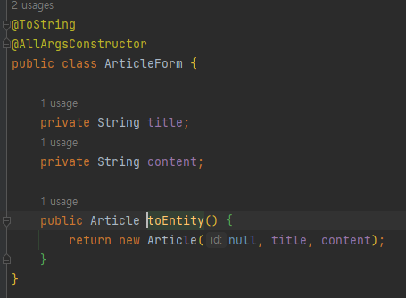

# Spring 공부

구조 src => main => java, resource


### 1. Tomcat

Tomcat으로 8080포트에 접근

### 2. MVC 패턴

mustache를 통해 만든다. => html을 다르게 부르는것?


컨트롤러에서 model의 정보를 받아 mustache에 넘긴다.

### 3. DTO

=> 폼데이터를 받는 객체


왼쪽부터 form에서 날린 데이터가 DTO로가서 Form데이터 형식으로 변환후 Controller로 날아감


### 4. Controller에서 DTO와 entity로 바꿔주는 기능을 담당

DTO에서는 Entity로 바꾸는 toEntity 메소드도 포함!

ArticleRepository Package에서는 Entity를 CRUD할 수 있는 CrudRepository 상속받아 사용 


### 5. 저장된 데이터를 조회하기


h2.Database에 접근허용

```sql
INSERT INTO ARTICLE(id,title,content) VALUES(3,'gfdsg','12314');
```

### 6. Lombok

- 코드를 간소화 시켜주는 메소드


이랬던 코드가

Lombok Annotation을 쓰면

 

이렇게 생성자와 toString메소드를 생략할 수 있다.

### 데이터 조회


### Repository에서 ArrayList로 받게하기


그 후 Controller에서 List로 받는다.