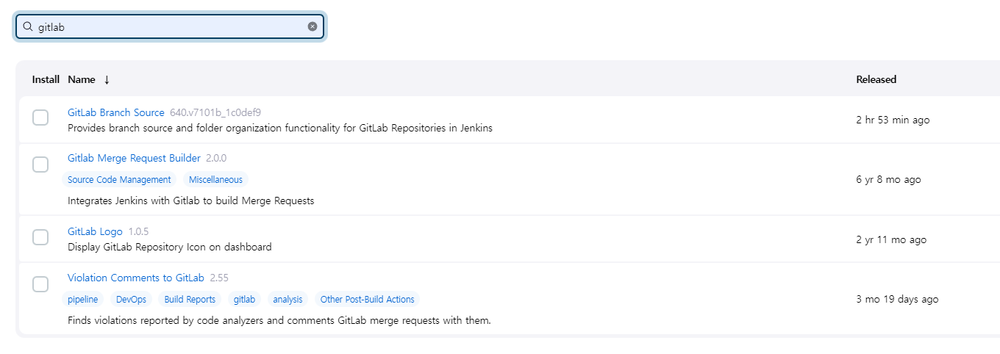

# 배포


### 1. 사전준비

#### 1) AWS 계정 만들기

- 키페어 test1

pem key 다운로드가능

#### 2) 인스턴스 생성

- pem key 생성
- 포트생성

#### 3) 탄력적 IP 할당

- 생성된 인스턴스에 탄력적 IP할당

#### 4) SSH 연결


- SSH : Secure Shell의 줄임말로, 원격 호스트에 접속하기 위해 사용되는 보안 프로토콜

- ssh -i test.pem ubuntu@(탄력적 ip) => ubuntu에 연결(20.04.5 LTS버전)

--------------------------

### 2 .Docker설치

#### 1) 사전패키지 설치

```bash
sudo apt update
sudo apt-get install -y ca-certificates \
    curl \
    software-properties-common \
    apt-transport-https \
    gnupg \
    lsb-release
```

### 2) gpg 키 다운로드

```bash
sudo mkdir -p /etc/apt/keyrings
curl -fsSL https://download.docker.com/linux/ubuntu/gpg | sudo gpg --dearmor -o /etc/apt/keyrings/docker.gpg

echo \
    "deb [arch=$(dpkg --print-architecture) signed-by=/etc/apt/keyrings/docker.gpg] https://download.docker.com/linux/ubuntu \
    $(lsb_release -cs) stable" | sudo tee /etc/apt/sources.list.d/docker.list > /dev/null
```

도커를 설치하기 위해 gpg Key를 다운받아야 합니다. 이는 리눅스 패키지 툴이 프로그램 패키지가 유효한지 확인하기 위해 설치 전에 gpg 키를 통해 검증하는 과정을 거치기 때문에 gpg 키를 받아야 한다고 합니다.

### 3) Docker 설치

```bash
sudo apt update
sudo apt install docker-ce docker-ce-cli containerd.io docker-compose
```

여기까지 EC2에 도커 설치완료

---------------

### 2. Docker에 Jenkins설치

#### 1) docker 컨테이너 설계

```bash
vim docker-compose.yml
```

```yml
version: '3'

services:
    jenkins: # 서비스 이름
        image: jenkins/jenkins:lts # 컨테이너 생성시 사용할 이미지
        container_name: jenkins # 컨테이너 이름
        volumes:
            - /var/run/docker.sock:/var/run/docker.sock
            - /jenkins:/var/jenkins_home # 공유폴더 : 기점으로 연결시킨다는 뜻
        ports:
            - "9090:8080"
        privileged: true
        user: root
```

위 내용을 복사하여 붙여넣기합니다. 각 단어에 대한 설명은 간단하게만 하겠습니다.

- services : 컨테이너 서비스
- jenkins : 서비스 이름
- image : 컨테이너 생성시 사용할 image, 여기서는 jenkins/jenkins:lts 이미지를 사용(jenkins의 lts버전을 가져온다는 뜻)
- container_name : 컨테이너 이름
- volumes : 공유 폴더 느낌, aws의 /var/run/docker.sock와 컨테이너 내부의 /var/run/docker.sock를 연결, /jenkins 폴더와 /var/jenkins_home 폴더를 연결.
- ports : 포트 매핑, aws의 9090 포트와 컨테이너의 8080 포트를 연결한다.
- privileged : 컨테이너 시스템의 주요 자원에 연결할 수 있게 하는 것 기본적으로 False로 한다고 한다.
- user : 젠킨스에 접속할 유저 계정 (root로 할 경우 관리자)

#### 2) docker-Container 생성

```bash
sudo docker-compose up -d
```


```bash
sudo docker ps # 컨테이너 올라가있는 것 확인
```


```bash
sudo docker logs jenkins # jenkins 비밀번호 찾기
```


Jenkins 계정생성후 접속

#### 3) 플러그인 설치



=> gitlab


=> docker


=> SSH도 설치


싸피 깃랩이랑 연동


commit 할때 빌드되게 함


고급버튼을 누르고 secret키 생성 => gitlab과 webhook을 연결할때 사용


다 완료되면 지금빌드를 눌러서 빌드를 해본다.


Webhook으로 Jenkins와 연결합니다.

### 3. 젠킨스와 연결된 gitlab 프로젝트로 도커 이미지 빌드

젠킨스에서 도커 빌드를 하기 위해서는 젠킨스 컨테이너 안에 도커를 설치해야 합니다. 도커 설치 방법은 Ec2에 도커를 설치할 때와 동일하게 진행합니다.

```bash
sudo docker exec -it jenkins bash
```

=> 젠킨스 컨테이너 접근

#### 1) 사전 패키지 설치

```bash
apt update
apt-get install -y ca-certificates \
    curl \
    software-properties-common \
    apt-transport-https \
    gnupg \
    lsb-release
```

#### 2) gpg 키 다운로드

```bash
mkdir -p /etc/apt/keyrings
curl -fsSL https://download.docker.com/linux/debian/gpg | gpg --dearmor -o /etc/apt/keyrings/docker.gpg

echo \
    "deb [arch=$(dpkg --print-architecture) signed-by=/etc/apt/keyrings/docker.gpg] https://download.docker.com/linux/debian \
    $(lsb_release -cs) stable" | tee /etc/apt/sources.list.d/docker.list > /dev/null
```


```bash
cat /etc/issue # 젠킨스 컨테이너 내부 설치된 os 체크 명령어
# Debian GNU/Linux 11 \n \l
```

### 3) Docker 설치

```bash
apt update
apt install docker-ce docker-ce-cli containerd.io docker-compose
```


### Django와 React에서 Dockerfile 만들기

#### 1) Django

```dockerfile
FROM python:3.9.5
WORKDIR /var/jenkins_home/workspace/deploytest/testproject
COPY requirements.txt ./

RUN pip install --upgrade pip
RUN pip install -r requirements.txt
COPY . .
CMD ["gunicorn", "testproject.wsgi", "--bind", "0.0.0.0:8080"]
```

#### 2) React

```dockerfile
FROM node:16.15.0 as build-stage
WORKDIR /var/jenkins_home/workspace/deploytest/testproject_react
COPY package*.json ./
RUN npm install
COPY . .
RUN npm run build
FROM nginx:stable-alpine as production-stage

COPY --from=build-stage /var/jenkins_home/workspace/deploytest/testproject_react/build /usr/share/nginx/html
#COPY --from=build-stage /var/jenkins_home/workspace/deploytest/testproject_react/deploy_conf/nginx.conf /etc/nginx/conf.d/default.conf
EXPOSE 80
CMD ["nginx", "-g","daemon off;"]
```

### Jenkins에서 Dockerfile 이용해서 도커이미지 생성

```dockerfile
docker image prune -a --force
mkdir -p /var/jenkins_home/images_tar
cd /var/jenkins_home/workspace/deploytest/testproject_react/
docker build -t react .
docker save react > /var/jenkins_home/images_tar/react.tar

cd /var/jenkins_home/workspace/deploytest/testproject_django/
docker build -t django .
docker save django > /var/jenkins_home/images_tar/django.tar

ls /var/jenkins_home/images_tar
```

- docker image prune -a --force : 사용하지 않는 이미지 삭제
- mkdir -p /var/jenkins_home/images_tar : 도커 이미지 압축파일을 저장할 폴더 생성
- cd /var/jenkins_home/workspace/deploytest/testproject_react : 해당 경로로 이동(react 프로젝트 폴더)
- docker build -t react . : 도커 이미지 빌드(React 프로젝트)
- docker save react > /var/jenkins_home/images_tar/react.tar : 도커 이미지를 react.tar로 압축하여 위에서 생성한 폴더에 저장
- cd /var/jenkins_home/workspace/deploytest/testproject_django/ : 해당 경로로 이동(django 프로젝트 폴더)
- docker build -t django . : 도커 이미지 빌드(Django 프로젝트)
- docker save django > /var/jenkins_home/images_tar/django.tar : 도커 이미지를 django.tar로 압축하여 위에서 생성한 폴더에 저장
- ls /var/jenkins_home/images_tar : 해당 폴더에 있는 파일 목록 출력(잘 압축되어 저장되었는지 확인)


=> django 배포가 안되는데 확인해보기 => gunicorn때문
